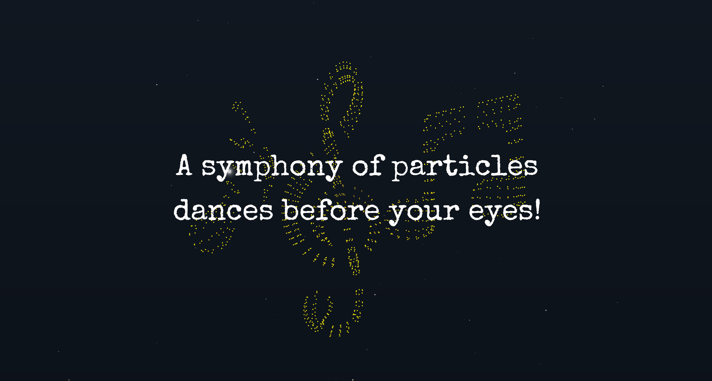

# Particle Symphony: A Visual Orchestration ✨

[](https://particle-symphony.vercel.app/)

**Particle Symphony** is a captivating exploration of the intersection between music and technology. Immerse yourself in a captivating world of sound and sight. Witness a symphony of particles as they transform from melodic notes to cosmic landscapes. Built with cutting-edge technologies like Next.js, Three.js, and React Three Fiber, this interactive experience invites you to explore the boundaries of music and art.

## Key Features:

- **Immersive Particle Effects:** Experience a symphony of particles morphing through various stages, from music notes to a cosmic explosion.
- **Interactive Exploration:** Engage with the art by scrolling through the different stages of the particle transformation.
- **Cutting-Edge Technology:** Built with Next.js, Three.js, React Three Fiber, React Three Drei, Custom Shader Materials, and GSAP, this project showcases the latest web development techniques.

## Built With

- [Next.js](https://nextjs.org/) (Frontend Framework)
- HTML & CSS (Structure and Styling)
- JavaScript (Interactivity)
- [Tailwind CSS](https://tailwindcss.com/) (Utility-First CSS Framework)
- [React Three Fiber](https://docs.pmnd.rs/react-three-fiber/getting-started/introduction) (3D Graphics Library)
- [React Three Drei](https://github.com/pmndrs/drei)
- Custom Shader Materials
- [React Intersection Observer](https://react-intersection-observer.vercel.app/?path=/docs/intro--docs)
- [GSAP](https://gsap.com/) (Animation Library)

## Getting Started

To get a local copy of this project up and running, follow these steps:

### Prerequisites

Make sure you have Node.js installed.

### Installation

Clone the repository and install dependencies.

```bash
git clone https://github.com/DV192/particle-symphony.git
cd particle-symphony
npm install
```

### Usage

Start the development server.

```bash
npm run dev
```

Visit http://localhost:3000 in your browser.

## Project Inspiration

This project was inspired by the incredible work of [Mister&Prada](https://github.com/MisterPrada) on their repository, [morph-particles](https://github.com/MisterPrada/morph-particles). Their innovative approach to using Three.js and Custom Shader Materials for particle effects greatly influenced the development of Particle Symphony.

## Deployment

This project is deployed on [Vercel](https://vercel.com/). Visit the live version [here](https://particle-symphony.vercel.app/).
